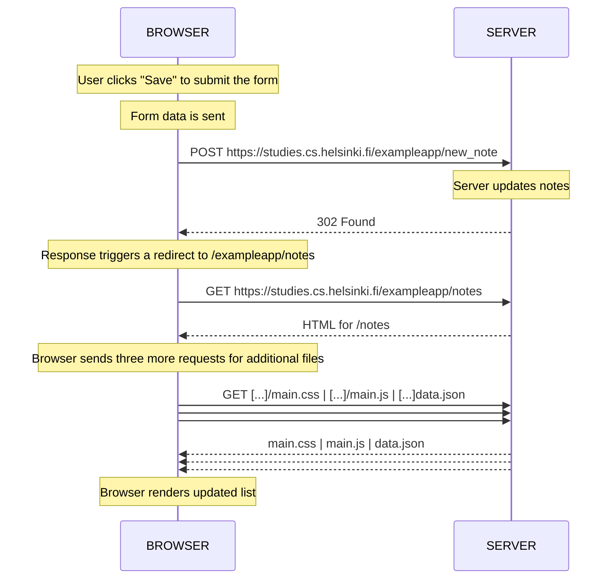

```mermaid
sequenceDiagram
    participant BROWSER
    participant SERVER
    Note over BROWSER: User clicks "Save" to submit the form
    Note over BROWSER: Form data is sent
    BROWSER->>SERVER: POST https://studies.cs.helsinki.fi/exampleapp/new_note
    Note over SERVER: Server updates notes
    SERVER-->>BROWSER: 302 Found
    Note over BROWSER: Response triggers a redirect to /exampleapp/notes
    BROWSER->>SERVER: GET https://studies.cs.helsinki.fi/exampleapp/notes
    SERVER-->>BROWSER: HTML for /notes
    Note over BROWSER: Browser sends three more requests for additional files
    BROWSER->>SERVER: GET [...]/main.css | [...]/main.js | [...]data.json
    BROWSER->>SERVER: 
    BROWSER->>SERVER: 
    SERVER-->>BROWSER: main.css | main.js | data.json
    SERVER-->>BROWSER: 
    SERVER-->>BROWSER: 
    Note over BROWSER: Browser renders updated list
```