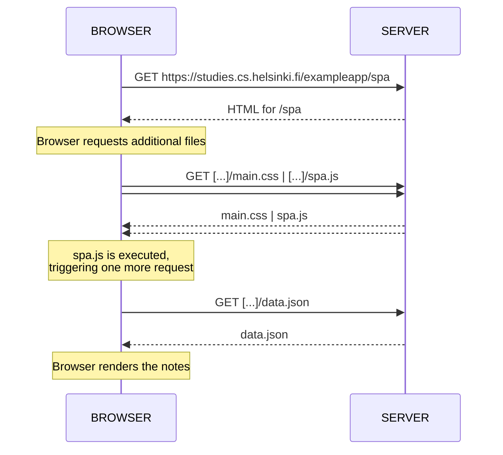

```mermaid
sequenceDiagram
    participant BROWSER
    participant SERVER
    BROWSER->>SERVER: GET https://studies.cs.helsinki.fi/exampleapp/spa
    SERVER-->>BROWSER: HTML for /spa
    Note over BROWSER: Browser requests additional files
    BROWSER->>SERVER: GET [...]/main.css | [...]/spa.js
    BROWSER->>SERVER: 
    SERVER-->>BROWSER: main.css | spa.js
    SERVER-->>BROWSER: 
    Note over BROWSER: spa.js is executed, <br/> triggering one more request 
    BROWSER->>SERVER: GET [...]/data.json
    SERVER-->>BROWSER: data.json
    Note over BROWSER: Browser renders the notes
```